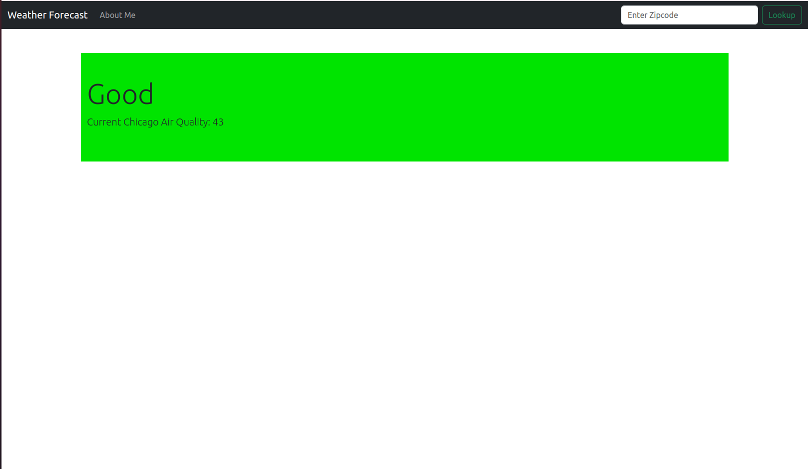
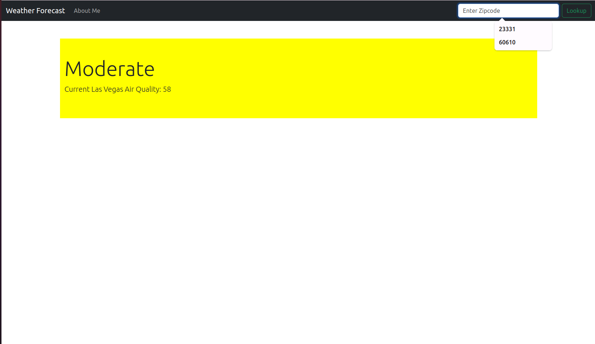

# 🌬️ Air Quality Prediction API

A simple Django REST API that predicts air quality index (AQI) based on input environmental data.

## 🚀 Features

- 🎯 Predicts Air Quality Index (AQI)
- 🌐 Built with Django + Django REST Framework

